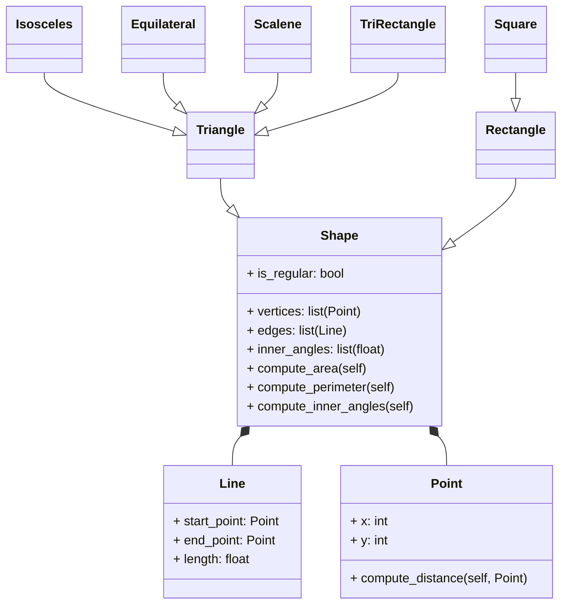

# Reto_04_POO

## 1. Ejercicio
## 1.1 Create a superclass called Shape(), which is the base of the classes Reactangle() and Square(), define the methods compute_area and compute_perimeter in Shape() and then using polymorphism redefine the methods properly in Rectangle and in Square.

```python
class Shape:
    def __init__(self):
        self.area = 0
        self.perimeter = 0
    def compute_area(self):
        pass
    def compute_perimeter(self):
        pass

class Rectangle(Shape):
    def __init__(self, width, height):
        super().__init__()
        self.width = width
        self.height = height

    def compute_area(self):
        self.area = self.width * self.height
        return self.area

    def compute_perimeter(self):
        self.perimeter = 2*(self.width + self.height)
        return self.perimeter

class Square(Shape):
    def __init__(self, side):
        super().__init__()
        self.side = side  

    def compute_area(self):
        self.area = self.side * self.side
        return self.area

    def compute_perimeter(self):
        self.perimeter = 4 * self.side
        return self.perimeter
```

## 1.2 Using the classes Point() and Line() define a new super-class Shape() with the following structure:


Use Inheritance, Composition, Encapsulation and Polymorphism to define the classes. All attributes must have their respective setters and getters.

```python
import math

class Point:
    def __init__(self, x, y):
        self.x = x
        self.y = y

    def compute_distance(self, other_point):
        return math.sqrt((self.x - other_point.x)**2 + (self.y - other_point.y)**2)

class Line:
    def __init__(self, start_point, end_point):
        self.start_point = start_point
        self.end_point = end_point
        self.length = self.compute_length()

    def compute_length(self):
        return self.start_point.compute_distance(self.end_point)

class Shape:
    def __init__(self):
        self.vertices = []  
        self.edges = []     
        self.inner_angles = []  
        self.is_regular = False

    def compute_area(self):
        pass
    def compute_perimeter(self):
        pass
    def compute_inner_angles(self):
        pass

class Triangle(Shape):
    def __init__(self, point1, point2, point3):
        super().__init__()
        self.vertices = [point1, point2, point3]
        self.edges = [Line(point1, point2), Line(point2, point3), Line(point3, point1)]
    
    def compute_area(self):
        a = self.edges[0].length
        b = self.edges[1].length
        c = self.edges[2].length
        s = (a+b+c)/2  
        area = math.sqrt(s*(s-a)*(s-b)*(s-c))
        return area

    def compute_perimeter(self):
        return sum(edge.length for edge in self.edges)

    def compute_inner_angles(self):
        a = self.edges[0].length
        b = self.edges[1].length
        c = self.edges[2].length
        angles = [
            math.degrees(math.acos((b**2 + c**2 - a**2) / (2 * b * c))),
            math.degrees(math.acos((a**2 + c**2 - b**2) / (2 * a * c))),
            math.degrees(math.acos((a**2 + b**2 - c**2) / (2 * a * b)))
        ]
        return angles

class Isosceles(Triangle):
    def __init__(self, point1, point2, point3):
        super().__init__(point1, point2, point3)
        if self.edges[0].length == self.edges[1].length or self.edges[1].length == self.edges[2].length or self.edges[2].length == self.edges[0].length:
            self.is_regular = True

class Equilateral(Triangle):
    def __init__(self, point1, point2, point3):
        super().__init__(point1, point2, point3)
        if self.edges[0].length == self.edges[1].length == self.edges[2].length:
            self.is_regular = True

class Scalene(Triangle):
    def __init__(self, point1, point2, point3):
        super().__init__(point1, point2, point3)
        if self.edges[0].length != self.edges[1].length and self.edges[1].length != self.edges[2].length and self.edges[2].length != self.edges[0].length:
            self.is_regular = False

class TriRectangle(Triangle):
    def __init__(self, point1, point2, point3):
        super().__init__(point1, point2, point3)
        angles = self.compute_inner_angles()
        if any(abs(angle - 90) < 1e-6 for angle in angles):
            self.is_regular = True

class Rectangle(Shape):
    def __init__(self, point1, point2, point3, point4):
        super().__init__()
        self.vertices = [point1, point2, point3, point4]
        self.edges = [Line(point1, point2), Line(point2, point3), Line(point3, point4), Line(point4, point1)]
    
    def compute_area(self):
        base = self.edges[0].length
        height = self.edges[1].length
        return base * height

    def compute_perimeter(self):
        return sum(edge.length for edge in self.edges)

    def compute_inner_angles(self):
        return [90, 90, 90, 90]  

class Square(Rectangle):
    def __init__(self, point1, point2, point3, point4):
        super().__init__(point1, point2, point3, point4)
        if self.edges[0].length == self.edges[1].length == self.edges[2].length == self.edges[3].length:
            self.is_regular = True
```

## 2. The restaurant revisted
```python
class MenuItem:
    def __init__(self, name, price):
        self._name = name
        self._price = price
    
    def get_name(self):
        return self._name
    
    def set_name(self, name):
        self._name = name
    
    def get_price(self):
        return self._price
    
    def set_price(self, price):
        self._price = price
    
    def calculate_total_price(self):
        return self._price

class Beverage(MenuItem):
    def __init__(self, name, price, size):
        super().__init__(name, price)
        self._size = size

    def get_size(self):
        return self._size
    
    def set_size(self, size):
        self._size = size

    def calculate_total_price(self):
        price_multiplier = {"Small": 1, "Medium": 1.2, "Large": 1.5}
        return self._price * price_multiplier.get(self._size, 1)

class Appetizer(MenuItem):
    def __init__(self, name, price, portion_size):
        super().__init__(name, price)
        self._portion_size = portion_size

    def get_portion_size(self):
        return self._portion_size
    
    def set_portion_size(self, portion_size):
        self._portion_size = portion_size

    def calculate_total_price(self):
        portion_multiplier = {"Single": 1, "Double": 2}
        return self._price * portion_multiplier.get(self._portion_size, 1)

class MainCourse(MenuItem):
    def __init__(self, name, price, portion_size):
        super().__init__(name, price)
        self._portion_size = portion_size

    def get_portion_size(self):
        return self._portion_size
    
    def set_portion_size(self, portion_size):
        self._portion_size = portion_size

    def calculate_total_price(self):
        price_multiplier = {"Small": 1, "Regular": 1.5, "Large": 2}
        return self._price * price_multiplier.get(self._portion_size, 1)

class Order:
    def __init__(self):
        self._items = []  
        self._has_main_course = False

    def get_items(self):
        return self._items
    
    def set_items(self, items):
        self._items = items
    
    def add_items(self, items):
        for item in items:
            if isinstance(item, MenuItem): 
                self._items.append(item)
                if isinstance(item, MainCourse):  
                    self._has_main_course = True
    
    def calculate_total_bill(self):
        total = sum(item.calculate_total_price() for item in self._items)
        if self._has_main_course:
            total = sum(item.calculate_total_price() * (0.9 if isinstance(item, Beverage) else 1) for item in self._items)
        return total

    def apply_discount(self):
        total = self.calculate_total_bill()
        if len(self._items) > 5:
            total *= 0.9  # 10% discount
        return total


class Payment:
    def __init__(self, amount, payment_method):
        self._amount = amount  
        self._payment_method = payment_method  

    def get_amount(self):
        return self._amount
    
    def set_amount(self, amount):
        self._amount = amount
    
    def get_payment_method(self):
        return self._payment_method
    
    def set_payment_method(self, payment_method):
        self._payment_method = payment_method

    def process_payment(self):
        print(f"Procesando pago de ${self._amount:.2f} con {self._payment_method}...")
        return f"Pago de ${self._amount:.2f} procesado exitosamente con {self._payment_method}"
```
