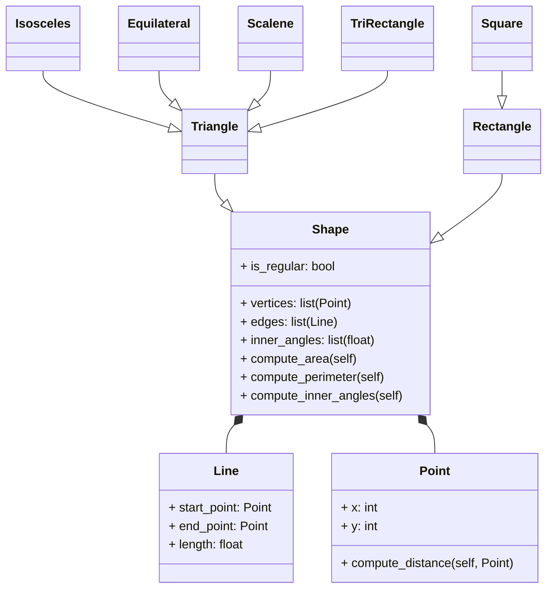

# Reto_04_POO

## 1. Ejercicio
## 1.1 Create a superclass called Shape(), which is the base of the classes Reactangle() and Square(), define the methods compute_area and compute_perimeter in Shape() and then using polymorphism redefine the methods properly in Rectangle and in Square.

```python
class Shape:
    def __init__(self):
        self.area = 0
        self.perimeter = 0
    def compute_area(self):
        pass
    def compute_perimeter(self):
        pass

class Rectangle(Shape):
    def __init__(self, width, height):
        super().__init__()
        self.width = width
        self.height = height

    def compute_area(self):
        self.area = self.width * self.height
        return self.area

    def compute_perimeter(self):
        self.perimeter = 2*(self.width + self.height)
        return self.perimeter

class Square(Shape):
    def __init__(self, side):
        super().__init__()
        self.side = side  

    def compute_area(self):
        self.area = self.side * self.side
        return self.area

    def compute_perimeter(self):
        self.perimeter = 4 * self.side
        return self.perimeter
```

## 1.2 Using the classes Point() and Line() define a new super-class Shape() with the following structure:


Use Inheritance, Composition, Encapsulation and Polymorphism to define the classes. All attributes must have their respective setters and getters.
